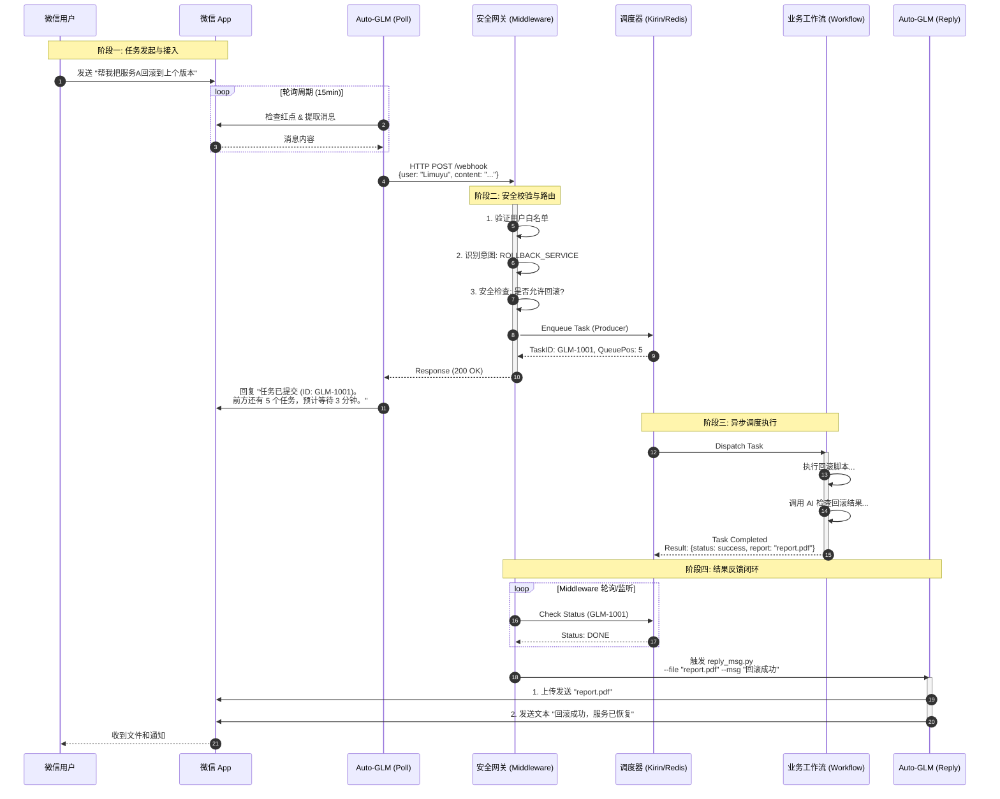

# Auto-GLM + Fengchao 智能任务编排系统架构

## 1. 核心架构设计

本系统构建了一个从**端侧自然语言交互**到**后端智能任务编排**的完整闭环。它利用 Auto-GLM 作为感知手和执行手，利用 Fengchao/Kirin 作为大脑和调度中心。

### 1.1 系统分层架构 (ASCII Art)

```ascii
+-------------------------------------------------------------------------------+
|                           用户交互层 (User Interaction)                       |
|   +-------------+       +-------------------------+       +---------------+   |
|   |  微信用户   | <---> |  物理机/虚拟机 (WeChat) | <---> |  Auto-GLM IO  |   |
|   +-------------+       +-------------------------+       +-------+-------+   |
|                                                                   |           |
+-------------------------------------------------------------------|-----------+
                                                                    | 1. 获取消息
+-------------------------------------------------------------------|-----------+
|                           安全与网关层 (Security & Gateway)       v           |
|   +-----------------------------------------------------------------------+   |
|   |  Middleware Bridge (ai_worker_dispatcher/server.py)                             |   |
|   |                                                                       |   |
|   |  +----------------+    +----------------+    +-------------------+    |   |
|   |  | 身份鉴权 (Auth)| -> | 意图识别 (NLU) | -> | 安全风控 (Safety) |    |   |
|   |  | (User Allowlist)|    | (Classify)     |    | (Intent Guard)    |    |   |
|   |  +----------------+    +----------------+    +-------------------+    |   |
|   +-----------------------------------+-----------------------------------+   |
|                                       | 2. 提交任务                           |
+---------------------------------------|---------------------------------------+
                                        v
+-------------------------------------------------------------------------------+
|                           任务调度层 (Job Scheduler - Kirin)                  |
|   +-----------------------------------------------------------------------+   |
|   |  Kirin Queue Manager (Redis Based)                                    |   |
|   |  [ Queue: High ] [ Queue: Medium ] [ Queue: Low ]                     |   |
|   |  Status: Pending -> Running -> Done/Failed                            |   |
|   +-------------------+---------------------------------------------------+   |
|                       | 3. 派发 (Dispatch)                                    |
+-----------------------|-------------------------------------------------------+
                        v
+-------------------------------------------------------------------------------+
|                           业务执行层 (Workflow Execution)                     |
|   +-----------------------------------------------------------------------+   |
|   |  Worker Nodes (AI Coding Agent / DevOps Runner)                       |   |
|   |                                                                       |   |
|   |  [ Workflow A: 部署服务 ]  [ Workflow B: 数据查询 ]  [ Workflow C: 审批 ] |   |
|   |  (调用 LLM, Shell, API...)                                            |   |
|   +-----------------------------------+-----------------------------------+   |
|                                       | 4. 执行结果 (Result)                  |
+---------------------------------------|---------------------------------------+
                                        v
+-------------------------------------------------------------------------------+
|                           结果反馈层 (Result Feedback)                        |
|   +-----------------------------------------------------------------------+   |
|   |  Middleware Result Handler                                            |   |
|   |  1. 接收任务完成信号                                                  |   |
|   |  2. 格式化结果 (文本/图片/文件路径)                                   |   |
|   |  3. 调用 Auto-GLM 回调脚本 (reply_msg.py)                             |   |
|   +-----------------------------------+-----------------------------------+   |
|                                       | 5. 唤醒发送                           |
+---------------------------------------|---------------------------------------+
                                        v
                            (回到用户交互层 - 发送微信)
```

## 2. 详细业务流程 (Mermaid Sequence)



## 3. 关键模块设计细节

### 3.1 安全层 (Middleware)
*   **用户白名单**: 在 `server.py` 中维护 `ALLOWED_USERS` 列表，非白名单用户的消息直接忽略并记录日志，防止未授权访问。
*   **意图防护**: 针对高危操作（如删除、重启、回滚），增加二次确认机制或必须匹配特定的 "Magic Word" 才能触发。

### 3.2 任务状态反馈
*   **即时响应**: 用户提交后，必须立即告知 "已收到"，并给出预估排队信息（Queue Position），缓解用户焦虑。
*   **进度更新**: 对于超长任务，支持中间状态推送（如 "正在构建中 50%..."）。

### 3.3 结果层增强
*   不仅仅支持文本回复，还设计了对 **图片** 和 **文件** 的支持。
*   Auto-GLM 的回调脚本 `reply_msg.py` 将被扩展，支持 `--image` 和 `--file` 参数，利用 Auto-GLM 的 UI 操作能力点击 "+" 号发送文件。

### 3.4 持续服务
*   任务结束后，Auto-GLM 不会退出，而是回到 `Poll` 状态，继续下一轮的监听，形成 7x24 小时的守护服务。
