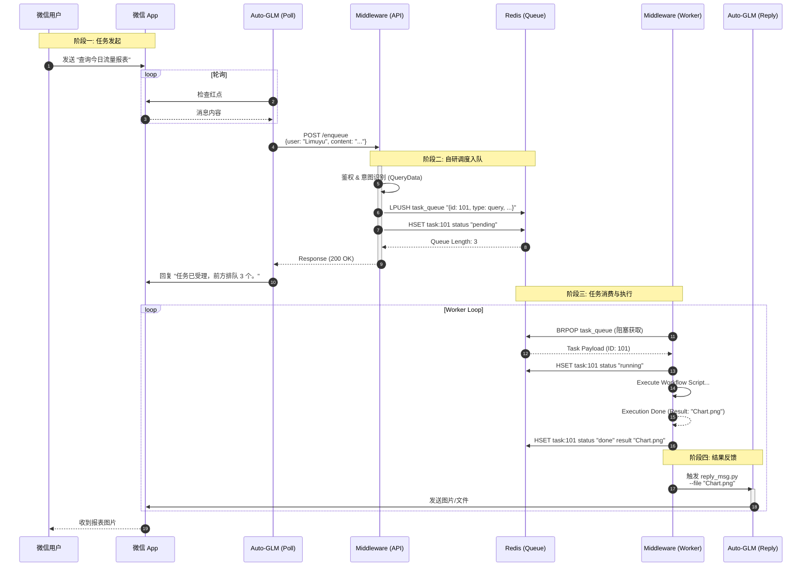

# AI小牧（数字员工）自研调度系统架构

## 1. 核心架构设计

鉴于不依赖外部 Kirin 调度器，我们将直接在 **Middleware Bridge** 中内置轻量级任务调度核心。该核心直接利用 Redis 实现任务队列、状态管理和 Worker 派发，构建一个闭环的自研调度系统。

### 1.0 命名规范（AI 小牧）
为统一命名与角色认知，核心组件对应关系如下：

| 旧称 | 新称（AI 小牧） | 职责 |
| --- | --- | --- |
| Poller（Auto-GLM 轮询） | **Xiaomu-Sentinel** | 端侧轮询微信/消息，提取用户意图并 Call_API 入队 |
| Queue Service (FastAPI) | **Xiaomu-Dispatcher** | `/enqueue` 入队、意图识别、状态记录、出队分发 |
| Executor (Workers) | **Xiaomu-Operator** | 运行 workflow（后端脚本或前端执行器），写状态 |
| Responder (reply_msg) | **Xiaomu-Messenger** | 统一持 UI 锁并向微信回复/通知 |
| Notify 任务/主动触达 | **Xiaomu-Pager** | 主动推送紧急/定时通知，走通知队列 |
| 前端执行器 (Auto-GLM main.py) | **Xiaomu-UI Runner** | 驱动 App/浏览器完成 UI 类任务（如小红书点赞/旅行比价） |
| Workflow Registry | **Xiaomu-Playbook** | 任务类型→脚本/命令映射的白名单 |

### 1.1 系统分层架构 (ASCII Art)

```ascii
+-------------------------------------------------------------------------------+
|                           用户交互层 (User Interaction)                       |
|   +-------------+       +-------------------------+       +---------------+   |
|   |  微信用户   | <---> |  物理机/虚拟机 (WeChat) | <---> |  Auto-GLM IO  |   |
|   +-------------+       +-------------------------+       +-------+-------+   |
|                                                                   |           |
+-------------------------------------------------------------------|-----------+
                                                                    | 1. 获取消息
+-------------------------------------------------------------------|-----------+
|                           自研网关与调度层 (Gateway & Scheduler)  v           |
|   [ Middleware Server ] (FastAPI + Redis)                                     |
|                                                                               |
|   +-------------------+    +---------------------+    +-------------------+   |
|   | 1. API 网关       | -> | 2. 调度核心 (Core)  | -> | 3. 状态管理       |   |
|   | (Auth / Guard)    |    | (Task Queue)        |    | (Redis State)     |   |
|   +-------------------+    +----------+----------+    +-------------------+   |
|                                       | Enqueue / Dequeue                     |
|                                       v                                       |
|   +-----------------------------------------------------------------------+   |
|   |  Redis (Task Broker)                                                  |   |
|   |  List: [Task_A, Task_B, ...]  |  Hash: {Task_A: running}              |   |
|   +-----------------------------------------------------------------------+   |
+---------------------------------------|---------------------------------------+
                                        | 4. 派发 (Dispatch)
                                        v
+-------------------------------------------------------------------------------+
|                           业务执行层 (Workflow Workers)                       |
|   +-----------------------------------------------------------------------+   |
|   |  Middleware Worker Pool (后台线程 / 子进程)                           |   |
|   |                                                                       |   |
|   |  [ Worker 1 ]      [ Worker 2 ]      [ Worker 3 ]                     |   |
|   |       |                 |                 |                           |   |
|   |  +---------+       +---------+       +---------+                      |   |
|   |  | Script A|       | Script B|       | Script C|                      |   |
|   |  +---------+       +---------+       +---------+                      |   |
|   +-----------------------------------+-----------------------------------+   |
|                                       | 5. 执行结果 (Result)                  |
+---------------------------------------|---------------------------------------+
                                        v
+-------------------------------------------------------------------------------+
|                           结果反馈层 (Result Feedback)                        |
|   +-----------------------------------------------------------------------+   |
|   |  Middleware Result Handler                                            |   |
|   |  1. 接收 Worker 结果                                                  |   |
|   |  2. 格式化 (文本/图片/文件)                                           |   |
|   |  3. 唤醒 Auto-GLM (reply_msg.py)                                      |   |
|   +-----------------------------------+-----------------------------------+   |
|                                       | 6. 微信发送                           |
+---------------------------------------|---------------------------------------+
                                        v
                            (回到用户交互层)
```

## 2. 详细业务流程 (Mermaid Sequence)



## 3. 关键模块实现 (Middleware 内置)

### 3.1 调度核心 (Scheduler Core)
不再调用外部脚本，而是直接在 `task_queue_service/server.py` 中实现：
*   **Producer**: 接收 HTTP 请求，生成 UUID，写入 Redis List (`task_queue`)。
*   **Consumer**: 启动独立的 Python 线程或进程（`threading.Thread`），死循环 `BRPOP` 消费队列。

### 3.2 状态管理
利用 Redis Hash 结构 `task:{id}` 存储全生命周期状态：
*   `status`: pending -> running -> success/failed
*   `created_at`, `started_at`, `finished_at`
*   `result`: 文本结果或文件路径

### 3.3 任务执行器
*   **安全执行**: 使用 `subprocess.run` 执行具体的 Shell 脚本或 Python 脚本。
*   **超时控制**: 为每个任务设置 `timeout`，防止死锁。

### 3.4 扩展性
*   虽然是自研简易调度，但通过 Redis 解耦，支持未来横向扩展 Worker 节点（多台机器同时消费同一个 Redis 队列）。

## 4. 轮询 → 意图识别 → 入口脚本工作流

> 目标：轮询微信消息后，**先识别用户意图**，再按意图触发不同的入口脚本（Workflow），执行完成后通过 Auto-GLM 回复用户。

### 4.1 端侧轮询与投递
1. `scripts/poll_wechat.py`（Xiaomu-Sentinel）定时唤起 Auto-GLM，提取目标用户的新消息。
2. Agent 通过 `Call_API` 调用 `POST /enqueue`（Xiaomu-Dispatcher），传入 `{ user, content }`（可选 `task_type`/`script_args`）。
3. 若接口返回 `status=accepted`，Agent 在微信端回复“任务已接收/失败”，形成前置闭环。

### 4.2 意图识别与入队
在 `task_queue_service/server.py` 内：
* `detect_intent(content)`：基于关键词/规则（可替换为 LLM 调用）识别意图与对应 Workflow。
* 若请求包含 `task_type`：优先匹配 `WORKFLOW_REGISTRY`；若同名脚本 `scripts/{task_type}.py` 存在则自动注册动态 workflow，命令 `python scripts/{task_type}.py [script_args|content]`。
* 构造任务负载：`{id, user, content, intent, workflow, task_type, script_args, created_at}`。
* `LPUSH aglm:task_queue` 入队，并 `HSET aglm:task:{id}` 标记 `status=pending` 等元信息。

**意图到入口脚本映射示例**

| 意图 | 关键词例子 | 入口脚本/命令 | 说明 |
| --- | --- | --- | --- |
| `deployment_check` | 部署/上线/health/模型 | `scripts/check_deployment_cn.py --base-url ... --model ...` | 调用模型健康度检查脚本 |
| `report_query` | 查询/报表/统计/流量 | `python -c "print('Report placeholder...')"` | 占位脚本，可替换为真实报表工作流 |
| `general` | 兜底 | `python -c "print('Received intent=general ...')"` | 回显兜底，确保任务闭环 |
| `travel_plan` | 旅游/旅行/行程/攻略/机票/航班/高铁/火车/12306/携程/美团/住宿/酒店/比价 | `task_type=travel_plan` 或 `workflows/travel_plan.py`（可传 `--to/--from/--dates/--note` 等） | 多出发地旅行规划，前端执行器驱动小红书/携程/美团/12306，比价后出报告 |

> 扩展方式：在 `WORKFLOW_REGISTRY` 中新增入口脚本描述（命令构造函数、超时、说明），并在 `INTENT_RULES` 中增加关键词映射即可。

### 4.3 Worker 调度与执行
1. `worker_loop`（Xiaomu-Operator）多线程 `BRPOP aglm:task_queue` 阻塞拉取任务。
2. 更新状态 `running`，执行入口脚本（`subprocess.run`，可捕获 stdout/stderr，超时保护）。
3. 执行完成后写回 `status=success/failed` 与 `final_result` 至 `aglm:task:{id}`，或由外部执行器调用 `POST /finish`（Xiaomu-Dispatcher）写回。

### 4.4 结果回传
* Worker 根据执行结果拼装回复文本，调用 `scripts/reply_msg.py --user {user} --message {msg}`（Xiaomu-Messenger）唤起 Auto-GLM，完成微信侧反馈。
* 外部执行器可以通过 `POST /finish` 提交 `{task_id, status, result, user?}`，服务端统一写状态并触发回复。
* 若需要文件/图片，可在结果中写入路径，扩展 `reply_msg.py` 支持对应的发送动作。

### 4.5 关键配置
* 队列键名：`AGLM_TASK_QUEUE`（默认 `aglm:task_queue`）
* 状态键名前缀：`AGLM_TASK_PREFIX`（默认 `aglm:task`）
* Worker 数：`AGLM_WORKER_COUNT`，超时：`AGLM_CMD_TIMEOUT`
* 模型参数（用于部分入口脚本）：`PHONE_AGENT_BASE_URL`、`PHONE_AGENT_MODEL`、`PHONE_AGENT_API_KEY`

## 5. 本地化部署（无 Kirin/Fengchao）

### 5.1 组件拆分（单机双进程）
- `Queue Service`（FastAPI）：提供 `/enqueue` 接口，做意图识别、入队、状态查询。只依赖本地/自建 Redis。
- `Executor Service`（常驻进程）：阻塞消费队列、初始化执行空间、运行固定脚本、写回状态、推送结果给 Responder。
- `Responder`（可与 Executor 同进程的线程）：统一与交互层对接，调用 `scripts/reply_msg.py`。

### 5.2 本地启动步骤
1) 准备 Redis（本地或 Docker）：`docker run -p 6379:6379 redis:7-alpine`。  
2) 启动队列服务：`uvicorn task_queue_service.server:app --host 0.0.0.0 --port 8000`（提供 `/enqueue`）。  
3) 启动执行进程（如单机可与 Queue Service 同机启动）：复用 `task_queue_service/server.py` 的 worker/responder 线程，或拆成独立脚本监听同一个队列键。  
4) 启动轮询：`python scripts/poll_wechat.py --user <wx> --webhook http://127.0.0.1:8000/enqueue ...`。  
5) 验证：发消息触发任务，查看 Redis 状态键 `aglm:task:{id}`，确认微信侧收到回复。

### 5.3 配置约定（本地默认值）
- Redis：`AGLM_REDIS_HOST=127.0.0.1`、`AGLM_REDIS_PORT=6379`、`AGLM_REDIS_DB=0`。  
- 队列/状态键：`AGLM_TASK_QUEUE=aglm:task_queue`，`AGLM_TASK_PREFIX=aglm:task`。  
- Worker 数：`AGLM_WORKER_COUNT=1`（单机避免撞 UI），命令超时：`AGLM_CMD_TIMEOUT=300`。  
- 模型参数（透传给相关脚本）：`PHONE_AGENT_BASE_URL`、`PHONE_AGENT_MODEL`、`PHONE_AGENT_API_KEY`。

### 5.4 防撞线策略（本地 UI 占用）
- UI 全局锁：Responder 发送前用全局互斥（Redis SET NX 或文件锁）占用 UI，发送后释放。  
- 队列分级：UI 任务放主队列；如需并发计算，可使用第二个队列消费纯计算任务。  
- 幂等与重入：发送前检查任务 `status` 是否已完成；锁超时自动释放。

### 5.5 入口脚本白名单
- 在 `WORKFLOW_REGISTRY` 中注册本地脚本（固定 python/shell），只允许白名单命令执行。  
- 每个任务创建独立工作目录（如 `/tmp/aglm/{task_id}`），执行完清理，避免污染。

## 6. 文字化架构描述与 XML 图

### 6.1 自然语言描述
微信用户的消息由 Auto-GLM 轮询脚本抓取后，通过 Call_API 投递到 Queue Service。Queue Service 进行意图识别、写入 Redis 任务队列并记录状态哈希。Executor 持续从任务队列阻塞拉取，根据 workflow 白名单运行对应的 python/shell 脚本，完成后写回状态与结果。结果会生成通知任务或直接交给 Responder。Responder 获取 UI 锁后调用 `scripts/reply_msg.py`，将结果消息发送回微信用户。整个链路以 Redis 队列与状态哈希解耦，确保任务与通知都有持久化和重试能力。

### 6.2 XML 结构图（节点与连线）
```xml
  <diagram name="AutoGLM-Middleware">
    <nodes>
      <node id="user" label="WeChat User" type="actor"/>
      <node id="poller" label="Poller (Auto-GLM)" type="agent"/>
      <node id="queue" label="Queue Service (FastAPI)" type="service"/>
      <node id="taskq" label="Redis Task Queue" type="queue"/>
      <node id="state" label="Redis Task State" type="kv"/>
      <node id="executor" label="Executor (Workers)" type="service"/>
      <node id="notifyq" label="Notify Queue" type="queue"/>
      <node id="responder" label="Responder (reply_msg)" type="service"/>
    </nodes>
    <edges>
      <edge from="user" to="poller" label="WeChat messages"/>
      <edge from="poller" to="queue" label="POST /enqueue (Call_API)"/>
      <edge from="queue" to="taskq" label="Enqueue task"/>
      <edge from="queue" to="state" label="HSET status=pending"/>
      <edge from="executor" to="taskq" label="BRPOP task" direction="pull"/>
      <edge from="executor" to="state" label="status=running/success/failed"/>
      <edge from="executor" to="notifyq" label="Push notify task"/>
      <edge from="notifyq" to="responder" label="BRPOP notify"/>
      <edge from="responder" to="user" label="reply_msg.py -> WeChat"/>
    </edges>
  </diagram>
```

## 7. 自动触发交互层（后端主动通知）

场景：定时任务、后台事件（监控告警、业务流水）、工作流中途/完成时，需要直接唤起交互层（微信）通知用户，即使用户未先发起对话。

设计要点：
- 通知任务模型：`{id, type: "notify", user, channel: "wechat", message, ref_task_id, priority, created_at}`。可复用 `AGLM_TASK_QUEUE`，或独立 `aglm:notify_queue`。
- 触发入口：  
  1) 后端事件/监控回调 -> 调用 `/notify`（或直接 LPUSH 通知队列）。  
  2) 定时/批任务 -> Cron/Job 推送通知任务。  
  3) 工作流里程碑 -> Executor 在执行中途/完成时再推送额外的 notify 任务（而不仅是最终结果）。
- 流程：事件 -> enqueue notify -> Responder BRPOP -> 获取 UI 锁 -> `reply_msg.py` 发送 -> 记录发送状态/时间戳。  
- 幂等与限流：以 `ref_task_id + message` 或业务事件 ID 做去重；可在状态哈希中记录 `notified=yes`；按用户/时间窗口限流，避免刷屏。  
- 并发安全：UI 锁与发送超时释放；队列优先级可区分紧急通知与普通通知。  
- 权限与安全：通知生产方（调用 `/notify` 或直接入队）需鉴权/白名单，避免被滥用。

## 8. 前端动作型 Workflow（UI 执行器集成）

目标：当 Workflow 需要端侧 UI 操作（如小红书点赞、微信发送）时，仍由后端编排/排队/审计，但实际动作由前端执行器（Auto-GLM）完成。

设计要点：
- Workflow 注册：在 `WORKFLOW_REGISTRY` 中为 UI 任务定义专门的项（如 `xh_like`、`wechat_send`），命令为调用前端执行器（`main.py` 或封装脚本），传入 prompt/参数。
- 队列与锁：UI 任务共用 UI 队列/锁（Redis SET NX），执行前获取锁，完成后释放，防止撞 UI。
- 流程：意图识别 -> 入队（标记 workflow=ui_xxx） -> UI Worker 拉取 -> 获取 UI 锁 -> 调用前端执行器完成端侧动作 -> 写回状态/结果 -> Responder 通知微信。
- 鉴权/限流/审计：保持在后端完成（白名单、频控、日志），前端执行器仅做动作执行，不负责排队。
- 复用：任何 Workflow 需要端侧操作时，直接调用“前端执行器”这一层，而不绕开后端调度。

## 9. 持久化与跨会话恢复（Redis + 数据库）

- 双层存储：Redis 负责排队与即时状态；数据库（默认 SQLite，可替换 MySQL/Postgres）持久化任务主表与事件表，支撑跨会话 resume/审计。  
- 任务表字段示例：`id, user, type, status, redis_key, created_at, updated_at, last_checkpoint, resume_hint, retries, payload_json, result_summary`。  
- 事件表字段示例：`task_id, phase, status, input, output, checkpoint_token, created_at`。  
- 接口：`POST /enqueue` 入队时写 Redis+DB，`POST /finish` 写状态并触发通知，`GET /task/{id}` 返回任务摘要+最近事件，方便 CC/前端工具查询与 resume。  
- Resume 思路：在事件/任务表记录 `checkpoint_token` 和 `resume_hint`，下次继续时携带 token 再次入队或调用 /resume（可后续扩展）。  
- 安全与审计：持久化记录谁、何时、发起什么任务及执行结果，支持重放/追踪。
- 数据库配置：默认 `AGLM_DB_DRIVER=sqlite`（路径 `AGLM_DB_PATH`），可切换 `AGLM_DB_DRIVER=mysql` 并设置 `AGLM_DB_HOST/PORT/USER/PASSWORD/NAME`，使用 PyMySQL 驱动。

### 9.1 Redis 连接
- 环境变量：`AGLM_REDIS_HOST`（默认 127.0.0.1）、`AGLM_REDIS_PORT`（默认 6379）、`AGLM_REDIS_DB`（默认 0）。
- 队列键：`AGLM_TASK_QUEUE`（默认 `aglm:task_queue`）。
- 状态键前缀：`AGLM_TASK_PREFIX`（默认 `aglm:task`，实际键为 `aglm:task:{id}`）。

### 9.2 MySQL 连接与建表
- 环境变量：  
  - `AGLM_DB_DRIVER=mysql`  
  - `AGLM_DB_HOST`（默认 127.0.0.1）  
  - `AGLM_DB_PORT`（默认 3306）  
  - `AGLM_DB_USER`（默认 xm_user）  
  - `AGLM_DB_PASSWORD`（默认 xm_pass）  
  - `AGLM_DB_NAME`（默认 xiaomu）
- PyMySQL 驱动，自动建表（启动时执行），表结构：
  - `tasks`：`id VARCHAR(64) PRIMARY KEY, user VARCHAR(255), type VARCHAR(255), status VARCHAR(64), redis_key VARCHAR(255), created_at DOUBLE, updated_at DOUBLE, last_checkpoint TEXT, resume_hint TEXT, retries INT DEFAULT 0, payload_json MEDIUMTEXT, result_summary MEDIUMTEXT`
  - `task_events`：`id BIGINT AUTO_INCREMENT PRIMARY KEY, task_id VARCHAR(64), phase VARCHAR(255), status VARCHAR(64), input MEDIUMTEXT, output MEDIUMTEXT, checkpoint_token TEXT, created_at DOUBLE, INDEX idx_task_id (task_id)`
- SQLite（默认）表结构相同，路径由 `AGLM_DB_PATH` 控制，自动创建。

### 9.3 启动检查
- Redis：`redis-cli -h $AGLM_REDIS_HOST -p $AGLM_REDIS_PORT ping` 返回 PONG。  
- MySQL：`mysql -h $AGLM_DB_HOST -P $AGLM_DB_PORT -u$AGLM_DB_USER -p$AGLM_DB_PASSWORD $AGLM_DB_NAME -e "SELECT 1;"` 返回 1。  
- 服务启动：`uvicorn task_queue_service.server:app --host 0.0.0.0 --port 8000` 后，数据库若不存在表会自动创建。
