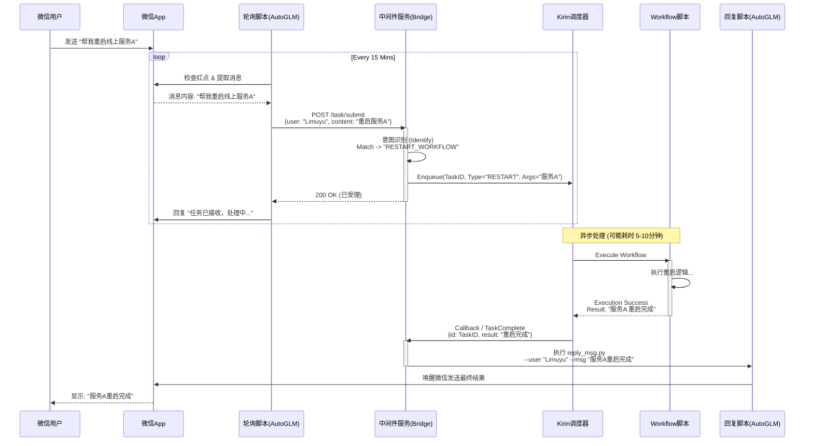

# Auto-GLM 与 内部任务系统 (Fengchao) 集成架构设计

本文档详细描述了如何将 **Open-AutoGLM**（作为端侧交互层）与 **cli-agent-server**（作为核心业务调度层）进行深度集成。

## 1. 核心设计理念

我们将构建一个中间件服务（**Middleware Bridge**），它的核心职责是**翻译**与**路由**：
1.  **翻译**: 将微信的自然语言（非结构化数据）转换为内部系统可识别的任务指令（结构化数据）。
2.  **路由**: 根据任务类型，将其分发给 `kirin/core` 调度器或直接执行 `workflow` 脚本。
3.  **闭环**: 监听任务执行结果，并驱动 Auto-GLM 回复用户。

## 2. 系统架构图 (ASCII)

```ascii
+-----------------------------------------------------------------------------------+
|                                 用户端 (User Layer)                               |
|   +-----------+                                                                   |
|   | 微信用户  |  <--- (自然语言交互) --->  [ 实体手机 / 模拟器 (WeChat) ]           |
|   +-----------+                                     ^                             |
|                                                     |                             |
+-----------------------------------------------------+-----------------------------+
                                                      |                             |
+-----------------------------------------------------+-----------------------------+
|                            Auto-GLM (IO Layer - 交互层)                           |
|                                                                                   |
|   [ poll_wechat.py ]  ----(1. 发现任务)--->  [ Auto-GLM Agent ]                   |
|          ^                                          |                             |
|          | (每15min轮询)                            | (2. Call_API 提取消息)      |
|          |                                          v                             |
|   [ reply_msg.py ]    <--(6. 回调回复)-----  [ Middleware Bridge (本服务) ]        |
|                                                     |                             |
+-----------------------------------------------------+-----------------------------+
                                                      | (3. 提交任务 /submit)       |
                                                      v                             |
+-----------------------------------------------------------------------------------+
|                       业务调度层 (Business Layer - Fengchao)                      |
|                                                                                   |
|   [ Bridge Service (FastAPI/Flask) ] -----------------------------------------+   |
|   | 1. 接收 Request: {user, content}                                          |   |
|   | 2. 意图识别 (Classifier): "帮我查数据" -> TaskType: "DATA_QUERY"          |   |
|   | 3. 任务包装 (Wrapper): 注入 Kirin 格式                                    |   |
|   +---------------------+-----------------------------------------------------+   |
|                         |                                                         |
|                         v (4. 入队 Enqueue)                                       |
|   +-------------------------------------------------------+                       |
|   |                Kirin Task Scheduler                   |                       |
|   | (/cli-agent-server/cli_agent_server/kirin/core)       |                       |
|   +---------------------+---------------------------------+                       |
|                         | (调度 Dispatch)                                         |
|                         v                                                         |
|   +-------------------------------------------------------+                       |
|   |                  Workflow Executors                   |                       |
|   | (/cli-agent-server/workflow/*.py)                     |                       |
|   |                                                       |                       |
|   |  Task A: 数据查询流   Task B: 部署流   Task C: 审批流 |                       |
|   +---------------------+---------------------------------+                       |
|                         |                                                         |
|                         | (5. 任务完成 Result)                                    |
|                         v                                                         |
|   +-------------------------------------------------------+                       |
|   |                Result Handler (Bridge)                |                       |
|   |  调用 reply_msg.py 将结果写回微信                     |                       |
|   +-------------------------------------------------------+                       |
+-----------------------------------------------------------------------------------+
```

## 3. 详细时序流程 (Mermaid)



## 4. 关键模块实现思路

### 4.1 中间件服务 (`ai_worker_dispatcher/server.py`)
我们需要编写一个新的 Python 服务，它需要能够 import 您的 `cli-agent-server` 代码。

**环境要求**: 该服务需要运行在能访问 `cli-agent-server` 依赖的 Python 环境中。

**代码逻辑伪代码**:

```python
from fastapi import FastAPI, BackgroundTasks
# 假设这是您的内部调度器引用方式
# import sys
# sys.path.append("/Users/limuyu/work/baidu/fengchao-tool/cli-agent-server")
# from cli_agent_server.kirin.core import TaskScheduler

app = FastAPI()

@app.post("/submit_task")
async def submit_task(data: dict, background_tasks: BackgroundTasks):
    user = data.get("user")
    content = data.get("content")
    
    # 1. 简单意图分类 (或调用 LLM 进行分类)
    task_type, params = classify_intent(content)
    
    if not task_type:
        return {"status": "ignored", "msg": "未识别的任务指令"}

    # 2. 提交给后台任务 (模拟 Kirin 入队)
    # 这里使用 BackgroundTasks 模拟异步，实际应调用 Kirin.submit()
    background_tasks.add_task(run_kirin_wrapper, user, task_type, params)
    
    return {"status": "success", "msg": "任务已派发"}

def run_kirin_wrapper(user, task_type, params):
    """
    包装器：调用内部 Workflow -> 等待结果 -> 触发 Auto-GLM 回复
    """
    try:
        # result = Kirin.run(task_type, params) # 同步或异步等待
        # 模拟执行
        import time
        time.sleep(5) 
        result = f"模拟执行结果: {task_type} 完成。"
        
        # 3. 回调 Auto-GLM
        trigger_reply_script(user, result)
        
    except Exception as e:
        trigger_reply_script(user, f"任务执行出错: {str(e)}")

def trigger_reply_script(user, message):
    import subprocess
    # 调用之前的 reply_msg.py
    cmd = [
        "python", "../scripts/reply_msg.py",
        "--user", user,
        "--message", message
    ]
    subprocess.run(cmd)
```

### 4.2 意图识别 (Classifier)
这是连接自然语言和固定 Workflow 的桥梁。建议初期维护一个 `TaskRegistry`：

```json
{
  "deploy_service": ["重启", "部署", "上线"],
  "query_data": ["查询", "看下", "多少"],
  "approval": ["审批", "同意", "驳回"]
}
```

## 5. 目录结构规划

建议在当前目录下建立 `ai_worker_dispatcher` 文件夹，专门存放这些胶水代码，保持与 `Open-AutoGLM` 核心解耦。

```text
/Users/limuyu/work/Open-AutoGLM/
├── ai_worker_dispatcher/
│   └── server.py           # FastAPI 服务入口（队列/状态/执行器封装）
├── scripts/
│   ├── poll_wechat.py      # 轮询脚本 (配置指向 dispatcher url)
│   └── reply_msg.py        # 回复脚本
└── ...
```
