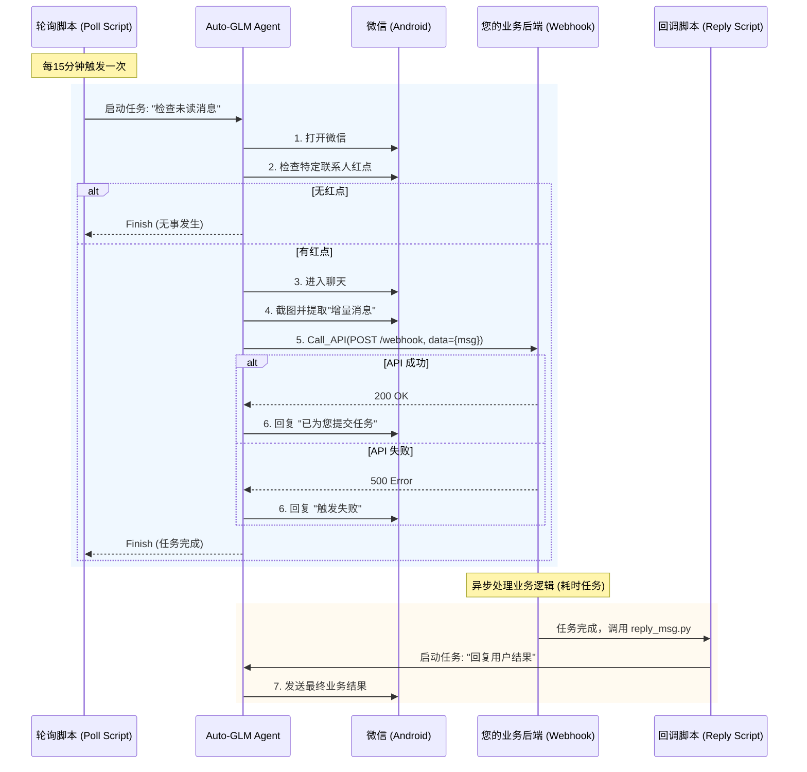

# Auto-GLM 安卓模拟器接入指南

本指南详细说明如何安装、配置安卓模拟器，并将其与 Auto-GLM 项目对接。

## 1. 模拟器选择与安装

我们推荐使用 **Android Studio Emulator**（官方、稳定）或 **MuMu模拟器**（轻量、国内兼容性好）。

### 方案 A: Android Studio Emulator (推荐开发者)
1.  **下载**: 访问 [Android Developer 官网](https://developer.android.com/studio) 下载并安装 Android Studio。
2.  **配置**:
    *   打开 Android Studio，点击 `More Actions` -> `Virtual Device Manager`。
    *   点击 `Create device`，选择 `Pixel 6` 或类似机型。
    *   **重要**: 选择系统镜像时，推荐下载 **Android 11.0 (R) 或更高版本** 的镜像（保证应用兼容性）。
    *   完成创建并启动模拟器。
3.  **ADB 状态**: 官方模拟器启动后通常自动监听 `localhost:5554`。

### 方案 B: MuMu 模拟器 / 蓝叠 (BlueStacks)
1.  **下载**: 访问官网下载安装程序。
2.  **设置**:
    *   启动模拟器。
    *   进入模拟器设置，开启 **“ROOT权限”** (可选，部分高级功能可能需要)。
    *   开启 **“USB调试”**：通常在 `设置 -> 开发者选项 -> USB调试`。如果没有开发者选项，请在 `关于手机` 中连续点击 `版本号` 5-7 次。
3.  **端口确认**:
    *   MuMu (Mac): 通常是 `localhost:22471` 或 `5555`。
    *   BlueStacks: 通常是 `localhost:5555`。

## 2. 环境验证

在终端中执行以下命令，确保 ADB (Android Debug Bridge) 能找到设备。

```bash
# 如果尚未安装 adb
brew install android-platform-tools  # macOS
# sudo apt install adb               # Ubuntu

# 查看连接设备
adb devices
```

如果列表为空，需要手动连接（以 MuMu 为例）：
```bash
adb connect localhost:22471
```

## 3. Auto-GLM 接入操作

在启动 Auto-GLM 时，使用 `--connect` 参数指定模拟器地址。

```bash
# 示例：连接本地 5554 端口的模拟器
python main.py --connect localhost:5554 "打开设置"
```

---

# Auto-GLM API 配置与启动指南

Auto-GLM 不需要本地运行大模型，支持直接调用 OpenAI 兼容格式的 API（如 ZhipuAI GLM-4V, GPT-4o）。

## 1. 必需的 API 参数

| 参数项 | 说明 | 示例 | 约束 |
| :--- | :--- | :--- | :--- |
| `base-url` | 模型 API 的接入点地址 | `https://open.bigmodel.cn/api/paas/v4` | 必须以 `http` 或 `https` 开头，通常以 `/v1` 或 `/v4` 结尾。 |
| `apikey` | 您的身份认证密钥 | `sk-abc123...` | 必须有效且有余额。不要泄露给他人。 |
| `model` | 调用的模型名称 | `glm-4v` | **必须支持视觉 (Vision)** 能力的模型。 |

## 2. 配置方式

### 方式 A: 命令行参数 (临时使用)
每次运行时直接传入参数：

```bash
python main.py \
  --base-url https://open.bigmodel.cn/api/paas/v4 \
  --apikey YOUR_API_KEY \
  --model glm-4v \
  "你的指令"
```

### 方式 B: 环境变量 (推荐长期使用)
在终端配置文件（如 `~/.zshrc` 或 `~/.bashrc`）中添加：

```bash
export OPENAI_API_BASE="https://open.bigmodel.cn/api/paas/v4"
export OPENAI_API_KEY="YOUR_API_KEY"
export MODEL_NAME="glm-4v"
```
生效后，运行 `python main.py "指令"` 即可。

## 3. 启动检查

运行以下简单指令测试配置是否成功：
```bash
python main.py "检查当前屏幕上的时间"
```
如果 Agent 成功输出屏幕上的时间，说明 API 和视觉模块配置正确。

---

# 微信自动化业务架构设计

本文档描述了“轮询监听 -> 触发业务 -> 业务回调 -> 微信回复”的完整闭环系统设计。

## 1. 业务流程图 (Mermaid)



## 2. 系统架构图 (ASCII)

```ascii
+-----------------------------------------------------------------------+
|                       控制端 (Host Machine / Server)                  |
|                                                                       |
|   +-------------------+       +-------------------+                   |
|   |   Cron / Loop     | ----> |   poll_wechat.py  |                   |
|   |   (定时调度器)    |       |   (轮询控制器)    |                   |
|   +-------------------+       +---------+---------+                   |
|                                         | 启动                        |
|                                         v                             |
|                           +---------------------------+               |
|                           |                           |               |
|                           |      Auto-GLM Core        |               |
|                           |      (Phone Agent)        |               |
|                           |                           |               |
|                           +-------------+-------------+               |
|                                         | ADB 指令                    |
|                                         v (USB/TCP)                   |
|   +-------------------------------------+-------------------------+   |
|   |                      安卓环境 (Android)                       |   |
|   |                                                               |   |
|   |   +-------------------------------------------------------+   |   |
|   |   |                        微信 App                       |   |   |
|   |   |  [联系人列表] -> [聊天界面] -> [输入框]               |   |   |
|   |   +-------------------------------------------------------+   |   |
|   +---------------------------------------------------------------+   |
|                                                                       |
+-----------------------------------+-----------------------------------+
                                    | Call_API (HTTP POST)
                                    v
+-----------------------------------+-----------------------------------+
|                        业务服务端 (Backend Server)                    |
|                                                                       |
|   +------------------+      +------------------+     +-----------+    |
|   |  Webhook 接收器  | ---> |  业务逻辑处理    | --> | 回调触发器|    |
|   |  (API Endpoint)  |      |  (DB/AI/Logic)   |     | (Trigger) |    |
|   +------------------+      +------------------+     +-----+-----+    |
|                                                            |          |
|                                                            | 调用     |
|                                                            v          |
|                                                  +------------------+ |
|                                                  |   reply_msg.py   | |
|                                                  |   (回复发送器)   | |
|                                                  +------------------+ |
|                                                            |          |
+------------------------------------------------------------+----------+
                                                             | 再次唤起 Agent
                                                             | (回到控制端)
```

## 3. 关键组件说明

1.  **Poll Script (`poll_wechat.py`)**:
    *   **职责**: 周期性看门狗。负责启动 Agent，并注入“先看红点，再提消息”的智能 Prompt。
    *   **状态管理**: 无状态，每次运行都是一次独立的 Agent 会话。

2.  **Auto-GLM Core**:
    *   **职责**: 执行具体的 UI 操作（点击、滑动、输入）。
    *   **新增能力**: 集成了 `Call_API`，使其能突破手机环境，与外部网络交互。

3.  **Backend Server (您的业务系统)**:
    *   **职责**: 接收 Agent 传来的结构化数据（用户、消息内容）。
    *   **异步处理**: 对于耗时任务（如查询订单、生成复杂报告），不应让 Agent 等待，应立即返回 200 OK，然后在后台处理。

4.  **Reply Script (`reply_msg.py`)**:
    *   **职责**: 闭环的最后一步。当 Backend 处理完业务后，主动调用此脚本，再次唤醒 Agent 将结果发回给用户。
